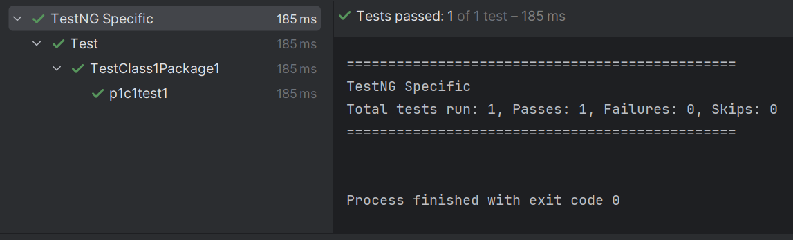
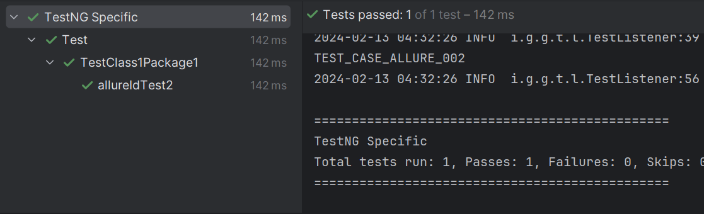
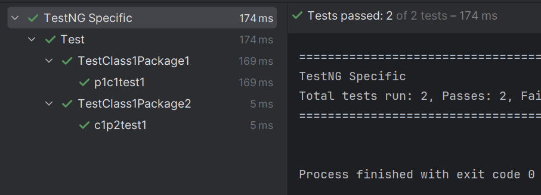
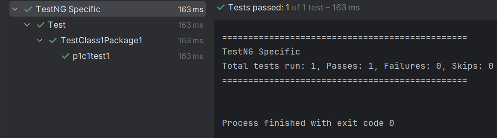
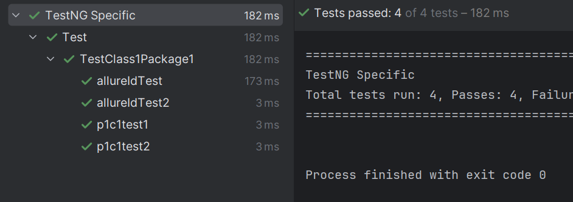

[](https://github.com/gungjodi/testng-specific/actions/workflows/maven.yml) [](https://github.com/gungjodi/testng-specific/actions/workflows/maven-publish.yml)

# TestNG Specific Test Starter
Execute TestNG by specific package, class name, groups, method name, and AllureID (Yes, this project already integrated with Allure Report)

<!-- TABLE OF CONTENTS -->
<details>
  <summary>Table of Contents</summary>
  <ol>
    <li>
      <a href="#about-the-project">About The Project</a>
      <ul>
        <li><a href="#built-with">Built With</a></li>
      </ul>
    </li>
    <li>
      <a href="#usage">Usage</a>
      <ul>
        <li><a href="#limitations">Limitations</a></li>
      </ul>
    </li>
    <li><a href="#license">License</a></li>
  </ol>
</details>


## About The Project
When running tests in TestNG, we need to put test execution based on package/class/group in testng.xml file. What if I need to run specific tests without worrying about creating some testng files for various tests?

This package could help to achieve that, just specify what needs to be executed in a single file

    ## specificTests.list
    package=io.github.gungjodi.testngspecificstarter → execute all tests in this package
    class=io.github.gungjodi.testngspecificstarter.ExampleTest → execute all tests in this class
    groups=groups1,groups2 → execute all tests on this groups
    testMethodExclude → execute only this method
    TEST_CASE_ID_002 → execute @AllureId annotation
    
    ...
    
    ## excludedTests.list
    package=io.github.gungjodi.testngspecificstarter → exclude all tests in this package
    class=io.github.gungjodi.testngspecificstarter.ExampleTest → exclude all tests in this class
    groups=groups1,groups2 → exclude all tests on this groups
    testMethodExclude → exclude only this method
    TEST_CASE_ID_002 → exclude @AllureId annotation

When running the test using `mvn test`, specific and excluded test lists can also be passed in maven commandline arguments

    mvn test -DspecificTest=<list of tests> -DexcludedTest=<list of excluded tests>

### Built With
This library utilizes TestNG [Listener](https://testng.org/testng_listeners.html) and method-selectors to choose which specific tests that needs to be executed.

## Usage
You can utilize this package in your existing TestNG project with some modification in testng.xml

1. Create project
2. Add dependency to maven pom.xml

   ```xml
   <dependencies>
      ...
      <dependency>
          <groupId>io.github.gungjodi</groupId>
          <artifactId>testng-specific-starter</artifactId>
          <version>${version}</version>
      </dependency>
      ...
   </dependencies>
   ```

3. This library comes with TestNG and Allure by default. If you want to use different version, set it in your pom.
4. Create test class and some test methods, example:
   ```java
   package io.github.gungjodi.testngspecific.package1;

   import io.qameta.allure.AllureId;
   import org.testng.annotations.Test;
   
   public class TestClass1Package1 {
   @Test(description = "Class1Package1.test1", groups = {"class1", "method1"})
   public void p1c1test1() {
   System.out.println("Class1Package1.test1");
   }
   
       @Test(description = "Class1Package1.test2")
       public void p1c1test2() {
           System.out.println("Class1Package1.test2");
       }
   
       @Test(description = "Test using AllureID", groups = {"class1", "method3"})
       @AllureId("TEST_CASE_ALLURE_001")
       public void allureIdTest() {
           System.out.println("TEST_CASE_ALLURE_001");
       }
   
       @Test(description = "Test using AllureID", groups = {"class1", "method3"})
       @AllureId("TEST_CASE_ALLURE_002")
       public void allureIdTest2() {
           System.out.println("TEST_CASE_ALLURE_002");
       }
   }
   ```
         
5. Add `testng.xml` file in your project with content like this

   ```xml
   <!--testng.xml-->
   <!DOCTYPE suite SYSTEM "https://testng.org/testng-1.0.dtd" >

   <suite name="TestNG Specific" verbose="1" configfailurepolicy="continue">
       <listeners>
           <listener class-name="io.github.gungjodi.testngspecificstarter.listeners.InvokedMethodListener"/>
           <listener class-name="io.github.gungjodi.testngspecificstarter.listeners.SuiteListener"/>
           <listener class-name="io.github.gungjodi.testngspecificstarter.listeners.TestListener"/>
       </listeners>
       <method-selectors>
           <method-selector>
               <selector-class name="io.github.gungjodi.testngspecificstarter.SuiteMethodSelector" priority="12"/>
           </method-selector>
       </method-selectors>
       <test name="Test">
           <method-selectors>
               <method-selector>
                   <selector-class name="io.github.gungjodi.testngspecificstarter.TestMethodSelector" priority="13"/>
               </method-selector>
           </method-selectors>
           <packages>
                <!-- specify package which contains all tests -->
                <!-- tests outside of this package will not be picked up -->
               <package name="io.github.gungjodi.testngspecific.*"/>
           </packages>
       </test>
   </suite>
   ```

6. Create `specificTests.list` and `excludedTests.list` file in `resource` directory

   ```text
   ## resource/specificTests.list
   ## this will execute method with name p1c1test1
   p1c1test1
   ```

7. Add `maven-surefire-plugin` in pom
   ```xml
   <plugin>
      <groupId>org.apache.maven.plugins</groupId>
      <artifactId>maven-surefire-plugin</artifactId>
      <version>${surefire.version}</version>
      <configuration>
         <testFailureIgnore>true</testFailureIgnore>
         <failIfNoTests>false</failIfNoTests>
         <suiteXmlFiles>
            <suiteXmlFile>path/to/testng.xml</suiteXmlFile>
         </suiteXmlFiles>
         <argLine>
            -javaagent:${settings.localRepository}/org/aspectj/aspectjweaver/${aspectj.version}/aspectjweaver-${aspectj.version}.jar
         </argLine>
      </configuration>
      <dependencies>
         <dependency>
            <groupId>org.aspectj</groupId>
            <artifactId>aspectjweaver</artifactId>
            <version>${aspectj.version}</version>
         </dependency>
      </dependencies>
   </plugin> 
   ```
8. Run the test using maven command
   ```shell
   mvn test
   ```
   or run the testng.xml file using IDE

9. Example results
   
   1. <i>Specific Test method run</i>
    
   2. <i>Specific AllureID</i>
   
   3. <i>Specific Group</i>
   
   4. <i>Specific Group with excluded test</i>
   
   5. <i>Class</i>
   

This library does not allow duplicated AllureID or method name. If there are duplicated AllureID or method name, it will throw an error and stop the test execution.
However, it can be disabled by setting `skipDuplicateCasesCheck` to true in mvn commandline arguments

### Limitations
1. Any configuration class `(@Before... / @After...)` should be modified with `(alwaysRun = true)`
   `@BeforeClass` → `@BeforeClass(alwaysRun = true)`, etc.

   When alwaysRun is not set to true, it will skip all tests when those configurations are failing and make some messes in logging

2. This library uses newer Allure dependencies, so if you are using older version of Allure, it might not work properly.
   A workaround for this is to modify older Allure adaptor annotation like `@Title / @TestCaseId`

   > @Title → @Description
   > 
   > @TestCaseId → @AllureId

   Then we can execute tests based on @AllureId value.

   <i>NB. if @AllureId annotation is specified in method, methodName in Allure Report will be modified to @AllureId value</i>